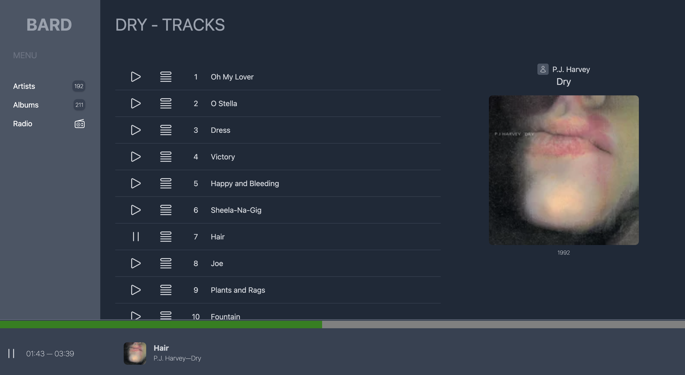

# Bard

Music player for your local network. Don't expect much.

# Tech

- Ruby on Rails
- Sidekiq for processing files
- howl.js for playing files
- Last.fm for music info

# TODO

- playlists
- TurboRails URL updates
